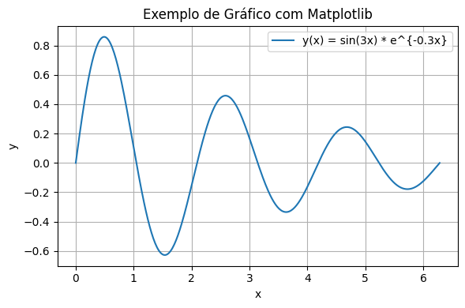

# hello-world
My first repository in the GitHub

# Capítulo 1 — Fundamentos

Este é um exemplo de fórmula escrita em LaTeX usando o Jupyter Book (MyST):

A transformada de Fourier contínua de uma função $\rho(\mathbf{r})$ é:

$$
\mathcal{F}\{\rho\}(\mathbf{q}) = \int_{\mathbb{R}^3} \rho(\mathbf{r})\, e^{i\,\mathbf{q}\cdot\mathbf{r}}\, d\mathbf{r}.
$$

E, em SAXS, a intensidade idealizada costuma ser proporcional a:

$$
I(\mathbf{q}) \propto \left| \mathcal{F}\{\rho\}(\mathbf{q}) \right|^2.
$$

